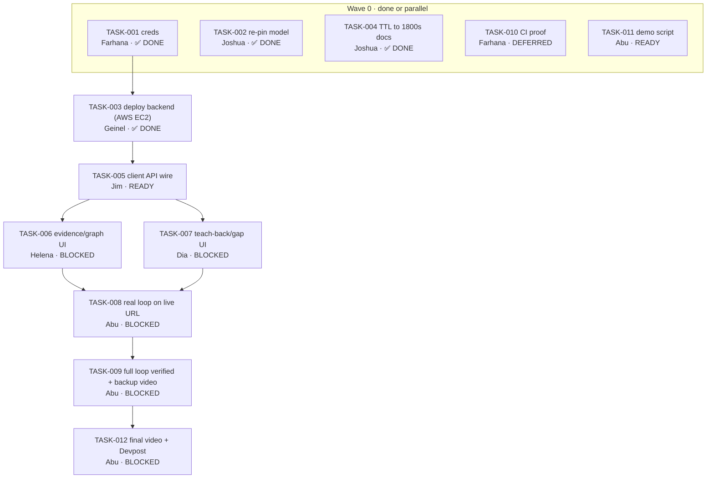

# Implementation Plan — living execution state (FMD 4.3)

> **Purpose:** the canonical bridge from specs to code **and the current build state**. It answers:
> what is ready, blocked, in review, done, or cut; who owns it; what it may touch; and what evidence
> proves it. It does **not** duplicate product intent, architecture, test definitions, or decisions —
> those remain in the [PRD](prd.md), [System Design](system-design.md), [QA Plan](qa-test-plan.md),
> and [Decision Ledger](DECISION-LEDGER.md)/ADRs.
>
> Traces to: `prd` (`F-###` / `INV-###`), `system-design`, `qa-test-plan` (`TC-###`). Stable task IDs
> originate here as `TASK-###`; never renumber or reuse one. `T-###` is reserved for security threats —
> never use it for execution tasks.
>
> **Deployment is Cloudflare Workers** (client live at `https://convex.varietase.workers.dev`, ADR-0003) +
> AWS EC2 FastAPI backend (pivoted from Hugging Face Docker Space). The historical Manila five-hour sprint
> plan is preserved in **Appendix A** for provenance; it is no longer the active execution owner.

**Plan steward:** Abu (owns cross-task dependencies, sequencing, shared write scopes, ready/blocked/parallel/cut view)
**Last checkpoint:** 2026-07-21T10:20 PHT · Plan checkpoint: TASK-002 done (root pin verified at 46ce4cd), TASK-004 done (TTL 1800s confirmed), Helena's MCP shell PR merged (CR-005)
**Deadline / demo cutoff:** hard submission **Wed Jul 22 08:00 PHT** (= Tue Jul 21 17:00 PT); healthy submit target **Tue Jul 21**; demo-ready = full loop on `convex.varietase.workers.dev`
**Current stopping point:** the pre-indexed sample loop, visibly labeled "illustrative preview — not a live analysis," served on the live Cloudflare Workers URL. This is the honest fallback if the live-backend loop does not land.

## 1. Planning inputs (refresh when context changes)

- **Current code state:** backend is feature-complete for F-001–F-005 (300+ local tests per the Decision Ledger — **PROVISIONAL** until verified on deployed EC2 instance); client is live on Cloudflare Workers but the deployed loop is still treated as static/illustrative until live backend verification. The local client worktree now includes the final-product repository connection shell (shared public GitHub URL modal, MCP placeholder path, centralized repository state, and `/dashboard`) documented in CR-005; real MCP host support remains future work. The `model` submodule root pin is at `46ce4cd` (past `d06dc29`); local checkout may lag.
- **Team capacity:** Abu (product/pitch/**plan steward**) · Joshua (backend lead — **out Jul 21–22**) · Geinel (senior dev; **covers Joshua's backend/integration Jul 21–22**) · Farhana (devops/AI-ML) · Jim (client integration + devops) · Helena (UI/UX) · Dia (UI/UX + a11y).
- **Core demo journey:** UF-004 / UJ-005 — sample → evidence-backed graph → cited evidence → three teach-back answers → supported/missing/unsupported feedback → gap-map update → back to source.
- **Highest implementation risks:** ~~credential blocker~~ (resolved); EC2 session loss on restart; keyboard/text-equivalent a11y in the build window; client-to-backend wiring on the live URL.
- **Required quality commands:** backend `cd model && uv run pytest` · client `cd client && npm run typecheck && npm run build` · plan `python3 fmd/tools/check-implementation-plan.py docs/implementation-plan.md`.
- **Browser E2E (convex has a browser UI):** cover **one** core smoke journey (the demo loop) with user-facing locators, isolated sample data, web-first assertions, Chromium first, and trace on first retry. Expand browsers/devices/sharding only with audience, rubric, compatibility, or measured-runtime evidence. **No packages, no `playwright.config.*`, and no CI workflow are added by this plan** — that is a later coding-layer decision (see `TASK-010`, deferred).
- **Hard constraints / rubric:** async-video judging at 4 × 25% (Technological Implementation/Codex · Design · Potential Impact · Quality of Idea); invariants **INV-001/002/003**; strictly read-only on user code; deadline above. See [`context.md`](../context.md), [`pitch-kit.md`](pitch-kit.md).

## 2. How this plan scales (derive; do not force fixed MVP→Final phases)

Execution **waves** are the topological layers of the `Depends on` DAG. Two tasks in the same wave are
**parallel candidates only when their write scopes are disjoint** — otherwise the steward serializes them,
splits scope, or adds a dependency. One task = one owner = one bounded write scope = one work reference =
one executable gate. The demo-critical path comes before polish; optional work is marked `cut`, never deleted.
`check-implementation-plan.py` prints the waves and flags literal same-wave scope overlaps; semantic coupling
(shared imports/contracts) is a judgment call it cannot see.

## 3. Task ledger (canonical — single source of execution status)

<!-- The plan checker validates THIS table only; it must remain the single 8-column table in the file.
     §4 is the derived, categorized human view. If the two ever disagree, §3 wins and §4 is recomputed. -->

| ID | Outcome / trace | Depends on | Owner | Write scope | Work ref | Status | Gate / evidence |
|----|-----------------|------------|-------|-------------|----------|--------|-----------------|
| TASK-001 | Credential unblock: OpenAI GPT-5.6 key provided; HF write token no longer needed (pivot to AWS EC2); infra | — | Farhana | none (external credentials; no repo write) | n/a (external credential, no code change) | done | `curl -fsS -H "Authorization: Bearer $OPENAI_API_KEY" https://api.openai.com/v1/models` · result: PASS — OpenAI API key verified; HF token requirement removed by EC2 pivot |
| TASK-002 | Re-pin root model gitlink 80390bb→d06dc29 (D1); F-001 | — | Joshua | model | n/a (root pin advanced to 46ce4cd via prior commits) | done | `git ls-tree HEAD model` · result: PASS — root pinned at 46ce4cd, past d06dc29; `cd model && uv run pytest` · result: PASS — 300 passed |
| TASK-003 | Deploy backend to AWS EC2; /health green; keyed production_smoke ×3 (pivot from HF Space to EC2); F-005 | TASK-001 | Geinel | none (EC2 runtime config; no repo write) | n/a (EC2 deploy via SSH/console, no repo branch) | done | `curl -fsS https://<ec2-endpoint>/health` · result: PASS — backend deployed on AWS EC2; /health responds; HF Space no longer used |
| TASK-004 | Reconcile session TTL to 1800s in docs (D3: match shipped code); docs | — | Joshua | docs/data-model.md, README.md | task/TASK-004-session-ttl | done | `grep -R "1800" docs/data-model.md README.md` · result: PASS — 1800s confirmed in both files |
| TASK-005 | Typed client API client; wire /v1 to live EC2 backend (sessionId/snapshotId, error envelope, base URL env); F-002 | TASK-003 | Jim | client/src/lib | — | ready | `cd client && npm run typecheck && npm run build` |
| TASK-006 | Evidence/graph surface: FocusWorkspace, EvidenceGraph, GraphLegend, PathList, CodePane, EvidenceDrawer, OmittedNotice; F-001 | TASK-005 | Helena | client/src/components/focus | — | blocked | `cd client && npm run build` |
| TASK-007 | Teach-back/gap surface: TeachBackCard, ResponseFindings, GapList/GapItem (gap_score, never %), a11y; F-004 | TASK-005 | Dia | client/src/components/teachback | — | blocked | `cd client && npm run build` |
| TASK-008 | Replace static preview with real loop on live URL; interim "illustrative" label until then (D4); F-005 | TASK-006, TASK-007 | Abu | client/src/app | — | blocked | `cd client && npm run build` |
| TASK-009 | Full loop verified on convex.varietase.workers.dev + backup video/fallback screenshot; F-004 | TASK-008 | Abu | docs/ops.md | — | blocked | `python model/production_smoke.py` |
| TASK-010 | CI/release proof (pytest + client checks on PR); deferred per current team decision; test | — | Farhana | .github/workflows | — | blocked | `cd model && uv run pytest` |
| TASK-011 | Demo script + shot-list for the sub-3-min video; docs | — | Abu | docs/pitch-kit.md | — | ready | `git diff --stat docs/pitch-kit.md` |
| TASK-012 | Final <3-min video + README/Codex write-up + Devpost submit; docs | TASK-009 | Abu | README.md, docs/pitch-kit.md | — | blocked | `git diff --stat README.md docs/pitch-kit.md` |
| TASK-013 | Comprehension-delta ledger; F-101 | — | Abu (steward, unassigned) | none/f-101-deferred | — | cut | `grep -c "F-101" docs/prd.md` |
| TASK-014 | In-workflow MCP App / extension surface; F-102 | — | Abu (steward, unassigned) | none/f-102-deferred | — | cut | `grep -c "F-102" docs/prd.md` |
| TASK-015 | Cross-repository learner graph; F-103 | — | Abu (steward, unassigned) | none/f-103-deferred | — | cut | `grep -c "F-103" docs/prd.md` |
| TASK-016 | Agent teaching contract; F-104 | — | Abu (steward, unassigned) | none/f-104-deferred | — | cut | `grep -c "F-104" docs/prd.md` |

## 4. Current execution view (derived from §3 — categorized; recompute at each checkpoint)

<!-- Reduced-column views for quick scanning; §3 is authoritative. Do not add the canonical 8-column
     header here or the checker will see two tables. -->

### 🔴 Blockers — gate the whole chain

_None._ The credential blocker (TASK-001) and deploy blocker (TASK-003) are resolved. The critical path now flows through TASK-005 (client API wire).

### 🟢 Ready now — no unfinished dependencies, disjoint write scopes (safe to run in parallel)

| ID | Outcome | Owner | Write scope | Gate |
|----|---------|-------|-------------|------|
| TASK-005 | Client API client wired to live EC2 backend | Jim | client/src/lib | `cd client && npm run typecheck && npm run build` |
| TASK-011 | Demo script + shot-list | Abu | docs/pitch-kit.md | `git diff --stat docs/pitch-kit.md` |

### ⚪ Blocked — waiting on an unfinished dependency

| ID | Outcome | Owner | Depends on | Unblocks when |
|----|---------|-------|------------|---------------|
| TASK-006 | Evidence/graph product surface | Helena | TASK-005 | API client returns a real graph |
| TASK-007 | Teach-back/gap product surface | Dia | TASK-005 | API client returns real findings |
| TASK-008 | Real loop on live URL (D4) | Abu | TASK-006, TASK-007 | both UI surfaces render real data |
| TASK-009 | Full loop verified + backup video | Abu | TASK-008 | loop runs end to end on live URL |
| TASK-012 | Final video + README/Codex + Devpost submit | Abu | TASK-009 | loop verified (or honest fallback ready) |

### ⏸ Deferred — tracked, not on the current critical path

| ID | Outcome | Owner | Why deferred |
|----|---------|-------|--------------|
| TASK-010 | CI/release proof (pytest + client checks on PR) | Farhana | Team is using the markdown plan + chat for now; CI/workflow integration is intentionally deferred. Joshua's Actions-workflow fix is claimed in progress but has no verified work ref. |

### 🔵 In progress / In review / Done

| ID | Outcome | Owner | Status | Evidence |
|----|---------|-------|--------|----------|
| TASK-001 | OpenAI GPT-5.6 key provided; HF token removed (EC2 pivot) | Farhana | done | OpenAI API key verified |
| TASK-002 | Re-pin root model gitlink (D1) — root at 46ce4cd, past d06dc29 | Joshua | done | `git ls-tree HEAD model` verified; 300 tests pass |
| TASK-003 | Backend deployed to AWS EC2; /health green | Geinel | done | Backend live on EC2; HF Space no longer used |
| TASK-004 | Reconcile session TTL → 1800s in docs (D3) | Joshua | done | 1800s confirmed in data-model.md + README.md |

### ✂️ Cut — explicitly out of scope for this build

| ID | Outcome | F-ID | Why cut |
|----|---------|------|---------|
| TASK-013 | Comprehension-delta ledger | F-101 | Final-tier feature. BR-009: "Final features F-101 through F-104 SHALL NOT displace completion of the F-001–F-005 end-to-end demo loop." That loop is not yet live end to end. |
| TASK-014 | In-workflow MCP App / extension surface | F-102 | Same as above; ADR-0002 marks the live MCP App/host implementation as future work. The current client MCP path is only a placeholder shell recorded in CR-004. |
| TASK-015 | Cross-repository learner graph | F-103 | Same as above; MVP sessions are ephemeral/session-scoped by design (no cross-repo learner state). |
| TASK-016 | Agent teaching contract | F-104 | Same as above; no MCP tool surface exists in the current two-repository architecture. |

These are recorded as `cut`, not omitted, so F-101–F-104 stay traceable and are not silently forgotten — and so no one accidentally starts them before the MVP loop (TASK-001→TASK-012) is proven end to end, per the Decision Ledger: "Do not start F-101 through F-104 until the complete F-001 through F-005 loop works." Revisit only after `TASK-009` (full loop verified) is `done`.

### Derived scheduling summary

- **Execution waves:** w0 {~~TASK-001~~✓, ~~TASK-002~~✓, ~~TASK-004~~✓, TASK-010, TASK-011, TASK-013–016 (cut)} · w1 {~~TASK-003~~✓} · w2 {TASK-005} · w3 {TASK-006, TASK-007} · w4 {TASK-008} · w5 {TASK-009} · w6 {TASK-012}.
- **Safe parallel set (now):** TASK-005, TASK-011 (disjoint scopes; all dependencies satisfied).
- **Integration order:** TASK-005 → (TASK-006 ∥ TASK-007) → TASK-008 → TASK-009 → TASK-012.
- **Cut line (if time slips):** public-repo breadth beyond one fixture → decorative polish/animation → extra concepts. **Never cut the sample loop or the video.** If integration slips, demo the real backend loop via a minimal wired surface, not the static preview.

### Dependency graph

Text-equivalent critical path: `TASK-005 → (TASK-006 ∥ TASK-007) → TASK-008 → TASK-009 → TASK-012`; independent: `TASK-011`; done: `TASK-001`, `TASK-002`, `TASK-003`, `TASK-004`; deferred: `TASK-010`.

## 5. Checkpoint transaction (the self-reconciliation loop)

Run a checkpoint when: a task starts, blocks, reaches review, merges, cuts, or fails a gate; a decision/pivot
is accepted; implementation reveals a new dependency or invalid assumption; time/team/scope/rubric changes; or
a work session, handoff, demo, or milestone ends.

At one checkpoint, make one coherent transaction:
1. **Observe reality** — inspect the branch/PR, code, tests, and deployment state. Chat and checked boxes are not evidence.
2. **Update §3** — change only facts proven by the event; add discovered work with a new `TASK-###`; never renumber or delete history (`cut` abandoned work).
3. **Reconcile by owner only if owned truth changed** — behavior → PRD; architecture → system design; test intent → QA plan; significant decision/pivot → Decision Ledger/ADR. Code that merely implements an unchanged spec must **not** churn docs.
4. **Recompute §4** — ready/blocked/safe-parallel/integration-order/cut, and re-run the plan checker.
5. **Attach evidence** — task/PR link + exact command/result. Set `in_review` before merge; the steward sets `done` only after integration and the gate still passes on the current base.

## 6. Team branch, PR, and conflict protocol (tool-neutral; no host automation added)

1. **Start a task.** If the steward pre-filled `Owner` for you (e.g. Geinel on the Jul 21–22 backend tasks), start it — do **not** re-claim or reassign. Otherwise claim a `ready`, unowned task. Either way: set `in_progress`, create `task/TASK-###-short-slug` from the current default branch, and fill `Work ref`. One task, one owner, one branch; never share a working branch.
2. Stay inside the declared `Write scope`. Need a shared/out-of-scope file? Checkpoint first — the steward serializes it or changes scopes/dependencies.
3. Open a small draft PR early: name `TASK-###`, affected `F-/INV-###`, docs impact (`none` is valid), and the exact validation commands.
4. **When the work is done (the owner's own checkpoint):** (a) run `python3 fmd/tools/check-implementation-plan.py docs/implementation-plan.md` and fix any REJECT; (b) attach real observed evidence to `Gate / evidence` (`result: PASS`, `CI: green`, or `artifact: <URL>`); (c) set your row to `in_review` in the same PR; (d) update PRD/system-design/QA **only if intended behavior actually changed**.
5. Bring the latest default branch into the task branch before final review and rerun gates.
6. A real conflict is not safe to solve with blanket `ours`/`theirs`: investigate both intents against the canonical docs, make the smallest correct diff, run targeted tests + the core smoke path, and escalate after three failed attempts (Iron Law).
7. **After merge, the plan steward — not the task owner — sets `Status` to `done`,** and only once the change is integrated and the gate still passes on the current base.

## 7. Plan change log (append-only, concise)

| Timestamp / event | Tasks changed | Why / evidence | Canonical docs reconciled |
|-------------------|---------------|----------------|---------------------------|
| 2026-07-20T01:22 PHT · FMD 4.2→4.3 migration | TASK-001…TASK-012 seeded | Establish the living execution plan as the sole execution-state owner; derived from `next-steps.md`, the Decision Ledger, and read-only repo/submodule state. No code/submodule/deploy state observed to change. | index · AGENTS · onboarding · Decision Ledger (ownership + §3 pivot); next-steps re-labeled historical |
| 2026-07-20T02:06 PHT · Final-tier traceability checkpoint | TASK-013…TASK-016 added, status `cut` | Made F-101–F-104 explicitly traceable and `cut` rather than absent, per BR-009 and the Decision Ledger's "do not start F-101–104 until the F-001–005 loop works." No MVP task/dependency/status changed. | none (no owned truth changed; PRD/system-design/QA already state this rule) |
| 2026-07-20T14:00 PHT · Credential + deploy pivot checkpoint | TASK-001 → done; TASK-003 → done; TASK-005 → ready | OpenAI GPT-5.6 API key provided (TASK-001 resolved). Architecture pivoted from Hugging Face Docker Space to AWS EC2 for backend deployment (TASK-003 resolved). HF write token no longer required. TASK-005 unblocked — client can now wire to live EC2 backend. | AGENTS.md (architecture section updated to reflect EC2); implementation-plan header + §1 risks updated |
| 2026-07-21T10:20 PHT · Plan checkpoint: verify + merge | TASK-002 → done; TASK-004 → done | Root model pin verified at 46ce4cd (past d06dc29 target); `uv run pytest` 300 passed. TTL 1800s confirmed in both docs. Helena's MCP shell PR #5 merged (CR-005) with EC2 conflict resolution. | none (no owned product/architecture truth changed; only execution state updated) |

---

## Appendix A — Historical: Manila five-hour build plan (superseded)

> **Status:** provenance only. This is the original Manila five-hour sprint schedule. It is **not** the active
> execution owner — §3 above is. Deployment is Cloudflare Workers (ADR-0003). Retained un-rewritten so the
> build history stays auditable.

### Build rule
Riskiest thing first: if deterministic evidence-backed edges do not work, stop—the remainder is a wrapper. Each gate reasserts INV-001–003. Current baseline stays Cloudflare Workers client + Hugging Face Docker Space, called directly by the browser over a CORS-allowlisted origin — no BFF/proxy.

Three builder roles per `master-plan-implementation.md` §9, mapped onto the team's real assignments:
- **Builder A — client explorer:** Helena/Dia
- **Builder B — deterministic backend:** Joshua/Farhana
- **Builder C — teaching pipeline:** Farhana (shared with Builder B) with Abu on demo/acceptance across every gate

### 0:00–0:20 — Contracts, sample, and deployments
- **Everyone:** create the two repositories (`client` = `xray-client`, `model` = `xray-backend`); deploy a blank Cloudflare Workers client; deploy a FastAPI `/health` endpoint to the Docker Space (port 7860); lock the sample repository; lock the data contracts; lock intake limits (40 files, 750KB total, 60KB/file, 5MB archive, 20MB extracted, 20s timeout); define stable ID formulas; add the invariant test file before feature code.
- **Gate:** client deployment opens; backend `/health` responds; both repositories share the same contract version; the demo sample and central path are known.

**Status 2026-07-18:** backend branch `feat/contracts-health` implements contract `1.0.0`, local sample `xray-demo-v1`, stable IDs, locked limits, invariant schemas, and `/health`; 29 tests and a live local smoke pass. Hugging Face deployment, Cloudflare deployment/shared client contract, and the final judge-facing sample remain open, so the 0:20 gate is not yet complete.

### 0:20–1:05 — Parallel foundation
- **Builder A:** establish dark-first token scaffolding from `design-system.md`; render mock symbols and edges; implement Inside/Around/Across controls; add selected-symbol state; add keyboard-focusable graph elements; add text-path placeholder; build the source pane.
- **Builder B:** implement sample intake; configure Tree-sitter parsers (JS/JSX/TS/TSX only); extract modules and symbols; create evidence references; return snapshot metadata.
- **Builder C:** define concept registry; define question specs; build LangGraph question pipeline with mocked evidence; define structured model schemas; add prohibited-language validator.
- **Gate:** sample source produces symbol records; mock graph can select a symbol; three mock question specs validate.

### 1:05–1:55 — F-001 evidence graph
- **Builder A:** connect UI to `POST /v1/analyses`; render real symbols with the neutral/coral graph palette; add edge evidence drawer; add non-color edge labels; keep cards rounded, outlined, and minimally elevated.
- **Builder B:** implement direct relative imports, same-file calls, named imported calls, module relationships; add unresolved-reference records; add provenance tests (exactly three evidence anchors per edge).
- **Builder C:** build evidence-linked pseudocode endpoint (`POST /v1/xray`); validate all returned evidence IDs; add cached sample explanation.
- **Gate:** a selected call edge exposes caller definition, call site, and callee definition; unsupported calls produce no edge; model output cannot modify the graph.

### 1:55–2:35 — F-002 semantic zoom and F-005 public intake
- **Builder A:** complete Inside/Around/Across behavior; preserve selected context across zoom levels; generate graph text alternatives; add smooth functional transitions and reduced-motion behavior.
- **Builder B:** implement bounded public snapshot intake; resolve the commit SHA; add archive-size and source-size guards; reject unsafe extraction paths and symlinks; add timeout handling.
- **Builder C:** implement deterministic concept occurrences; connect concept evidence to selected symbols; complete question selection from actual graph evidence.
- **Gate:** bundled sample works from the backend; one small public repository can be analyzed; zooming preserves selected symbol and path; repository concepts display without being labeled personal gaps.

### 2:35–3:20 — F-004 teach-back
- **Builder A:** build three-question interface; add one-submit evaluation flow; build Supported/Missing/Unsupported feedback sections; make source citations clickable.
- **Builder B:** produce required claims from graph evidence; build evidence packs for questions (`POST /v1/teachbacks/questions`); add allowlist validation; implement session-local learner-evidence format.
- **Builder C:** complete LangGraph answer-evaluation pipeline (`POST /v1/teachbacks/evaluate`); connect GPT-5.6 structured output; add model failure fallback; add wording restrictions.
- **Gate:** the learner can answer all three questions; every supported/missing feedback item cites source; unsupported claims say "not enough evidence"; no mastery wording appears.

### 3:20–3:50 — F-003 gap-map update
- **Builder A:** build gap cards with numeric score/rank; add repository and learner-evidence sections; clicking a gap selects the relevant symbol/path.
- **Builder B:** implement eligibility rules (repo evidence AND learner-answer evidence AND ≥1 missing/unsupported observation); implement session-local `gap_score = 70% learner_gap + 30% repository_relevance` ranking; ensure unknown concepts are omitted; return "no ranking changed" when appropriate.
- **Builder C:** generate concise rationale from validated evidence; add cached evaluation for the demo answers; verify no generic fallback concepts appear.
- **Hard MVP gate:** the complete loop works: sample → graph → evidence → three answers → feedback → updated gap map → return to code. Do not begin F-101 through F-104.

### 3:50–4:20 — Invariants and accessibility
- Run: edge provenance tests, unknown-evidence-ID tests, no-gap-before-answer tests, intake limit tests, read-only GitHub-adapter tests, keyboard-only graph traversal, visible focus check, reduced-motion check, dark-token contrast check, text-path check, model-unavailable check.
- **Gate:** hide or delete any feature that does not pass.

### 4:20–4:40 — Deployment reliability
- Set the backend CORS allowlist (deployed Cloudflare origin + local dev, no wildcard); store the model key only in Space secrets; confirm the backend listens on port 7860; verify the Cloudflare Workers production environment points to the Space API; test a fresh browser session; test the bundled sample after a backend restart; test cached explanation and cached evaluation; record a backup demo video; capture one full-screen fallback screenshot.
- **Gate:** production sample loop succeeds after a cold restart.

### 4:40–5:00 — README and rehearsal
- Document: product problem, invariant spine, architecture, exact supported scope, read-only behavior, known limitations, Codex collaboration, main Codex `/feedback` Session ID, GPT-5.6 runtime responsibilities, demo path.
- **Gate:** run the sub-three-minute demo twice without stopping.

### Honest stopping point
At the 3:50 hard MVP gate, a coherent demo exists: pre-indexed sample → grounded edge → teach-back → updated gap. Cut public-repo intake breadth, decorative polish, non-essential animations, extra concepts, and all F-101–104 before cutting this loop.

### Global polish (post-hackathon)
Add one safe public fixture, observability/rollback, README/install/test path, <3-minute video, citation/error polish, Devpost copy, and deployment availability. Do not implement MCP App/local sidecar until after submission; ADR-0002 remains proposed.
